# Spatial AI for Limit and Obstacle Detection

## Problem statement
Lawn mowing is a time-consuming and tiring routine household task. In recent years it has become one of the main personal robot applications. But even high-end products still require the expensive installation of boundary wires to ensure that the robot stays on the lawn. However, even with sich wires limiting the lawn area, numerous problems can occur, including the bot
* killing small animals such as hedgehogs,
* hurting children, cats, dogs,
* driving into molehills and
* crashing into "unwired" obstacles such as trees.

Proper abstacle detection for mowing bots can save lives, money and the bot itself. The aim is to prove that this can be achieved using the OpenCV AI Kit with Depth (OAK-D).

## Problem description
Considering the importance of health and safety and the dangers posed by a lawn mower's cutting blades, any solution for limit and obstacle detection needs to be sufficiently robust. The most common approach today are boundary wires that need to be burried surrounding and thus limiting the lawn area. Any other obstacle is detected with contact sensors once the robot crashes into it. However, the robot will require some time to actually stop. If the obstacle is small, light or flat enough, the robot will not stop. As the number of lawn mower bots increases so do the stories about cut cattails, dead hedgehogs, etc. Click on the video below for an illustration of our bot's behaviour when encountering obstacles.

# Solution
Spatial AI allows for multimodal solutions. OAK-D makes Spatial AI and Embedded AI available for everyone. I tried to fully leverage the power and functionality of OAK-D using all sensors and functionalities simultaneously:
* Neural inference for object detection on Intel Movidius Myriad X and 4K RGB camera
* Point cloud classification based both mono cameras for disparity/depth streams
* Disparity image classification based on disparity and rectified right streams
* Motion estimation using ectified right stream

OAKMower uses three classifers for limit and obstacle detection:
* Point Cloud ([Elliptic Envelope for Outlier Detection](https://scikit-learn.org/stable/modules/generated/sklearn.covariance.EllipticEnvelope.html))
* Disparity ([Support Vector Machine](https://scikit-learn.org/stable/modules/generated/sklearn.svm.SVC.html))
* Objects ([Mobilenet-SSD for Object Detection](https://docs.luxonis.com/tutorials/openvino_model_zoo_pretrained_model/))

Since for now control is out of scope, optical flow estimation was added to the pipeline to classify the movement of the robot.

## Setup

Live recording           |  OAK's view       
:-------------------------:|:----------------------:
           |  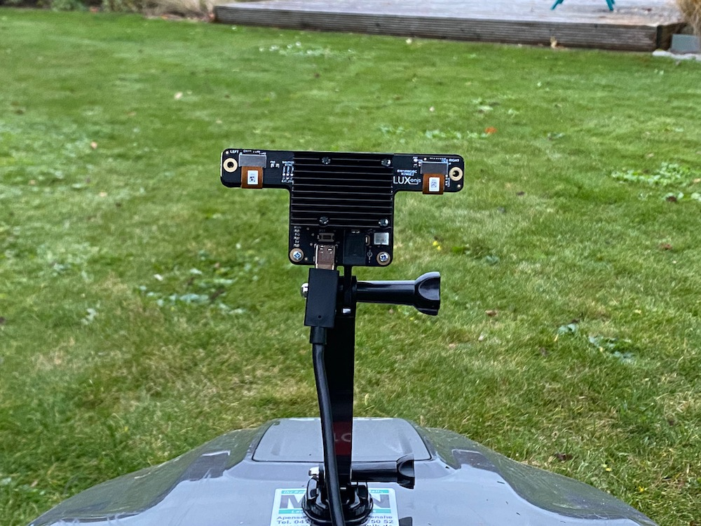

## Point cloud classification
### Idea
The point cloud obtained if enough free space is left in front of the bot should contain a significant amount of points belonging to a plane. Parameters describing the position of that plane in space should be relatively constant, mainly influenced by uneven terrain and camera movement. More points contained in the plane should mean more free space and higher confidence.

### Approach
The device does not allow for streaming both disparity and depth. Also, that would be a waste of bandwdith and frame rate as depth can be calculated from disparity as explained [in the DepthAI FAQs](https://docs.luxonis.com/faq/#how-do-i-calculate-depth-from-disparity). Using the intrinsics from the calibration files, [a point cloud can be calculated using Open3D.](https://github.com/luxonis/depthai-experiments/tree/master/point-cloud-projection) The [plane can be segmented robustly and fast within few iterations of the RANSAC algorithm.](http://www.open3d.org/docs/release/python_api/open3d.geometry.PointCloud.html#open3d.geometry.PointCloud.segment_plane) This allows for real-time use on the host.

#### Segmented plane inliers of point cloud

Lawn           |  Limit       
:-------------------------:|:----------------------:
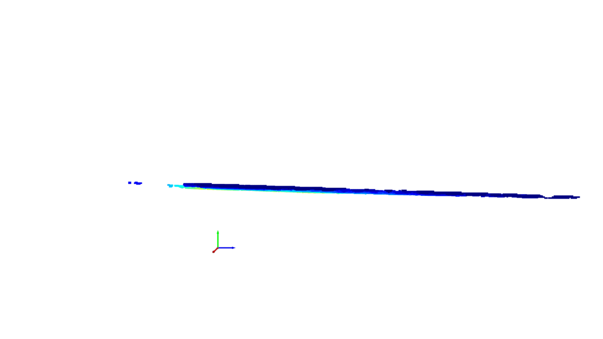           |  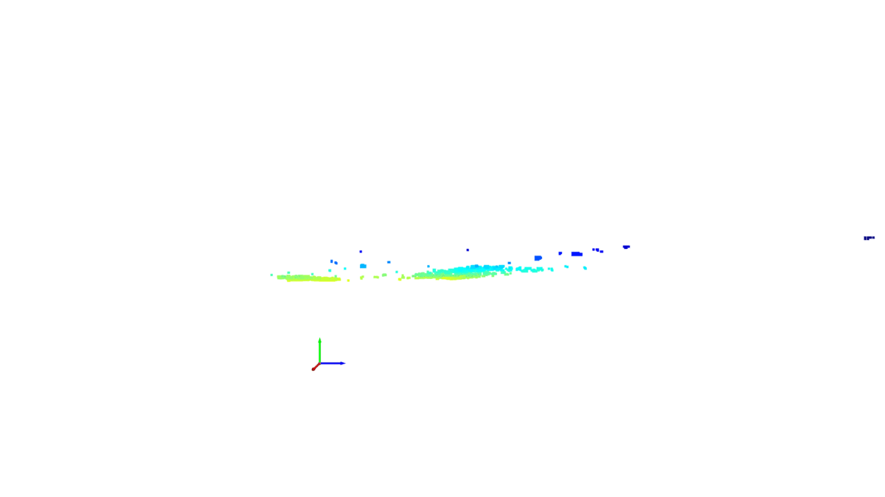

I used the parameters a, b, c and d

describing the plane as well as the amount of points considered as inliers of the plane as features to classify the point cloud as representing a clear path or obstacle. We can assume that the parameters of big clear path planes follow a normal distribution whereas obstacles can be considered outliers. Therefore, I decided to go for [anomaly detection algorithms](https://scikit-learn.org/stable/modules/outlier_detection.html) for the point cloud classifier.

## Filtered disparity classification
### Idea
The disparity/depth data is noisy and largely influenced by oclusions. Even assuming that outlier filtering is applied successfully, it will not be possible to tell if a flat area in front belongs to the lawn or plaster. Texture should be considered as well. Images combining both informations should allow for successful classification.

Lawn           |  Plant limit       |  Edgy limit
:-------------------------:|:-------------------------:|:-------------------------:
           |    |  

### Approach
OpenCV implements a tunable [Weighted Least Squares disparity filter](https://docs.opencv.org/3.4/d9/d51/classcv_1_1ximgproc_1_1DisparityWLSFilter.html) to refine the results in half-occlusions and uniform areas. Luxonis also provides a stand-alone [WLS filter example](https://github.com/luxonis/depthai-experiments/tree/master/wls-filter). The filtered image is expected to look different when comparing flat/lawn areas to limits or obstacles.
##### Issue: Minimum depth
Points below minimum depth will partially be filtered out. The remaining "holes" are present and look similar qualitatively on all images whereas the texture changes significantly in case of limits or obstacles.
##### Issue: Noisy absolute values
Even the WLS-filtered disparity still contains noise. To get grayscale invariance as well as translational invaariance, [local binary patterns](https://scikit-image.org/docs/dev/api/skimage.feature.html#skimage.feature.local_binary_pattern) were computed for the relevant image area and binned in a relative histogram serving as the input for a [Support Vector Machine](https://scikit-learn.org/stable/modules/generated/sklearn.svm.SVC.html) classifier. [Here](https://www.pyimagesearch.com/2015/12/07/local-binary-patterns-with-python-opencv/) you can find a good hands-on explanation.

##### Sidenote: Minimum depth
The [minimum depth](https://docs.luxonis.com/faq/#onboard-camera-minimum-depths) of the device depends on the camera baseline. In the case of the [OAK-D](https://docs.luxonis.com/products/bw1098obc/) used in this project the minimum depth was 0.689 meters. In my tests WLS filtering did a good job enhancing the results without needing the [extended disparity mode](https://docs.luxonis.com/faq/#extended_disparity) that is planned to be implemented in future DepthAI releases.
##### Sidenote: Semantic segmentation:
Training and running a semantic segmentation model on the device on RGB images is a promising approach. However, the texture can also be seen in the mono camera stream and until the release of the second generation pipeline builder the DepthAI API does not allow for inference of two models.

## Object classification
### Idea
Objects can be detected using the inference capabilities of OAK-D. If these are located in a pre-defined area of the image, the robot should stop and turn.

### Approach
The MobileNet-SSD model provided by DepthAI is optimized for fast inference and can prove the advantages of performing object detection for obstacle detection in addition to the other two classifiers.

# Results

## Feature evaluation & training

### Point cloud classification

As mentioned above, I assumed that due the nature of the data (stable if free lawn ahead with big deviations otherwise) the point cloud classifier can be based on [anomaly detection algorithms](https://scikit-learn.org/stable/modules/outlier_detection.html). This also allows for setting the contamination factor (relative amount of outliers) instead of labeling the data separately.
Below you see the results for a, b, c and d parameters on the y-axes and the amount of segmented plane inlier points on the x-axes after standard scaling. Since we know that high amounts of points (high x values) indicate lawn areas, the results can be interpreted quite intuitively.
When comparing the algorithms, I decided to use robust covariance as for my application.

25% outliers            |  35% outliers       
:-------------------------:|:----------------------:
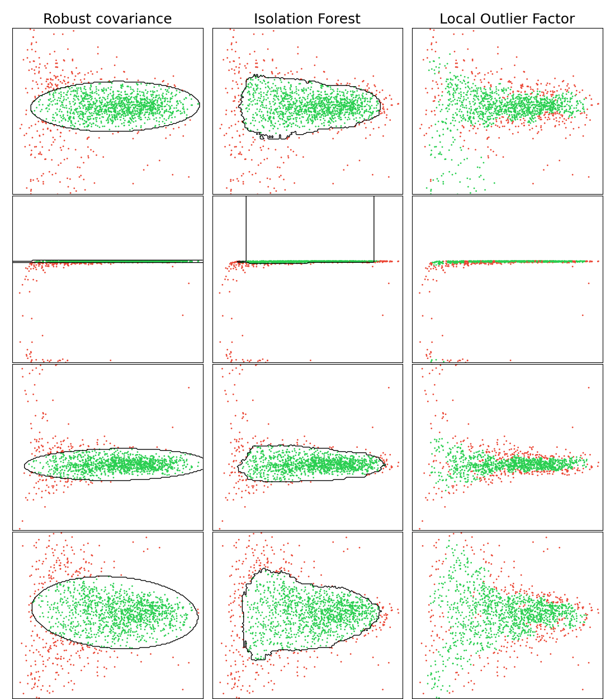  |  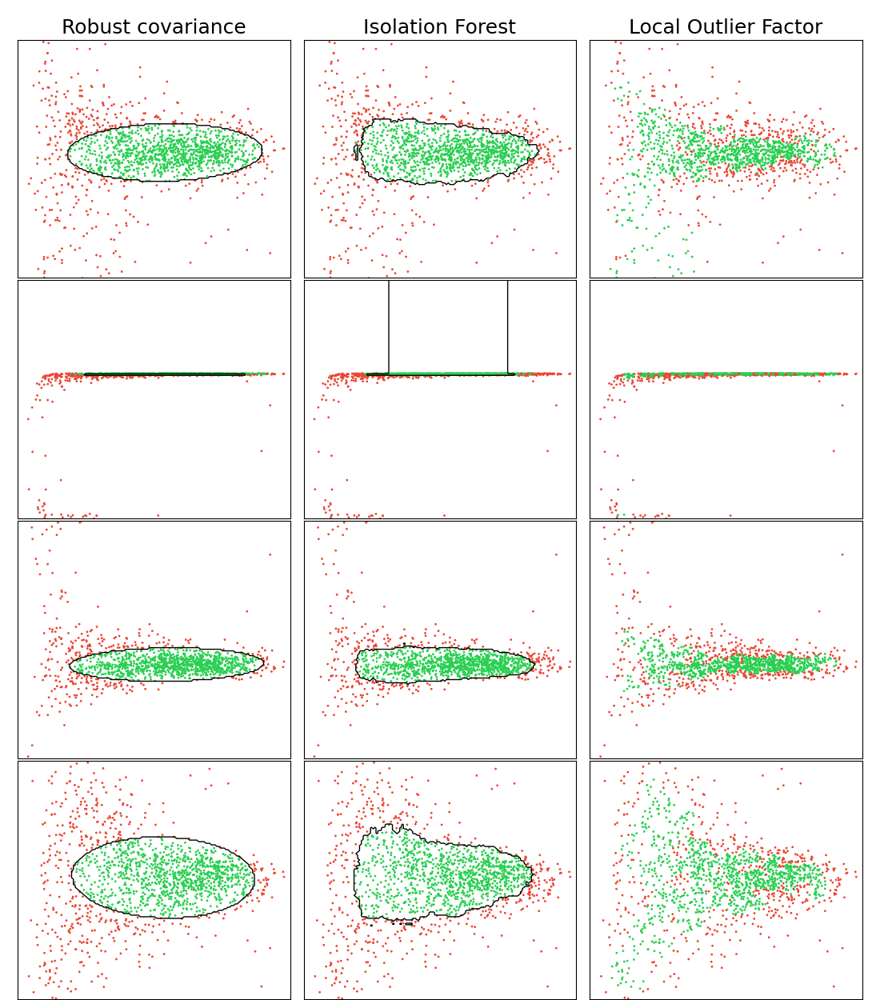

The amount of outliers is not known, but the chosen percentage can be used to adjust the threshold of the respective point cloud classifier.

### Filtered disparity classification

In contrast to the point cloud classification, to train the disparity classifier, the dataset had to be labeled before training the Support Vector Machine. To make sure that the chosen features (non-rotation invariant uniform LBPs) would be suitable, I performed a dimensionality reduction using [t-SNE](https://scikit-learn.org/stable/modules/generated/sklearn.manifold.TSNE.html). Note that with different initializations get you different results. Still, the plots indicate that the selected features are suitable for separating the data (green for clear path - red for limit/obstacle). For uniform LBPs this was not the case.

PCA initialization           |  Random initialization      
:-------------------------:|:----------------------:
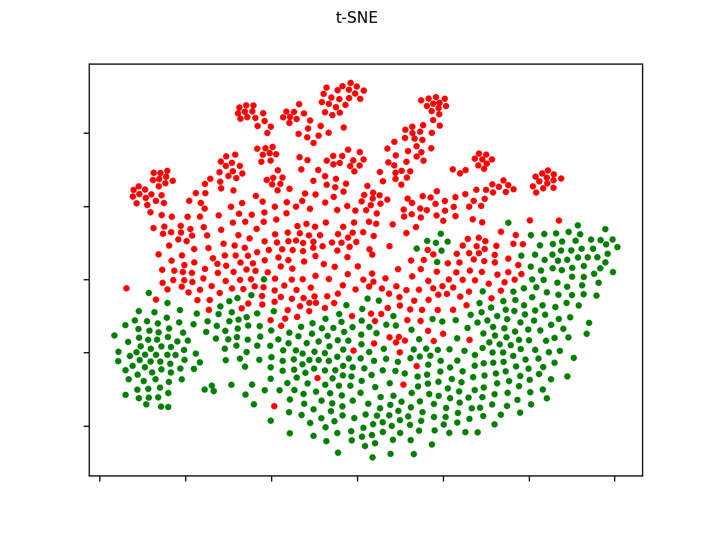  |  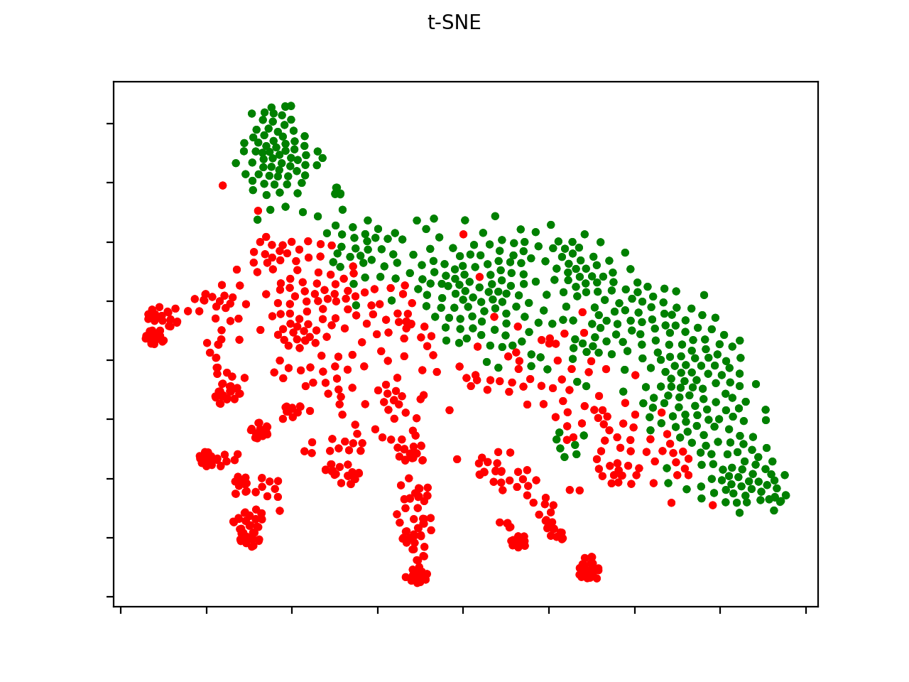

When training Support Vector Machines using different kernels and parameters I got the following results shown in box plots.

Linear          |  RBF     
:-------------------------:|:----------------------:
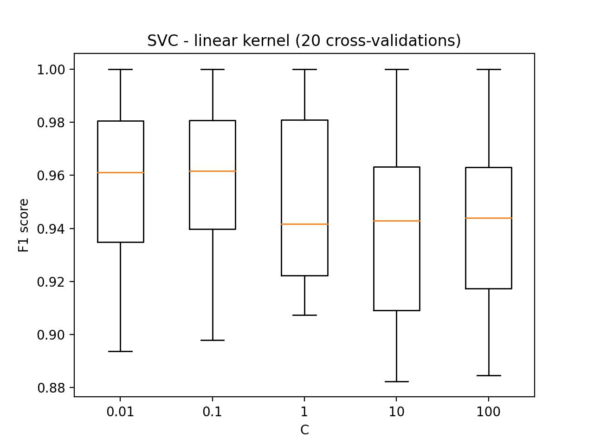  |  

## OAKMower in action

### Cockpit samples

Clear path           |  Approaching object       |  Approaching limit
:-------------------------:|:-------------------------:|:-------------------------:
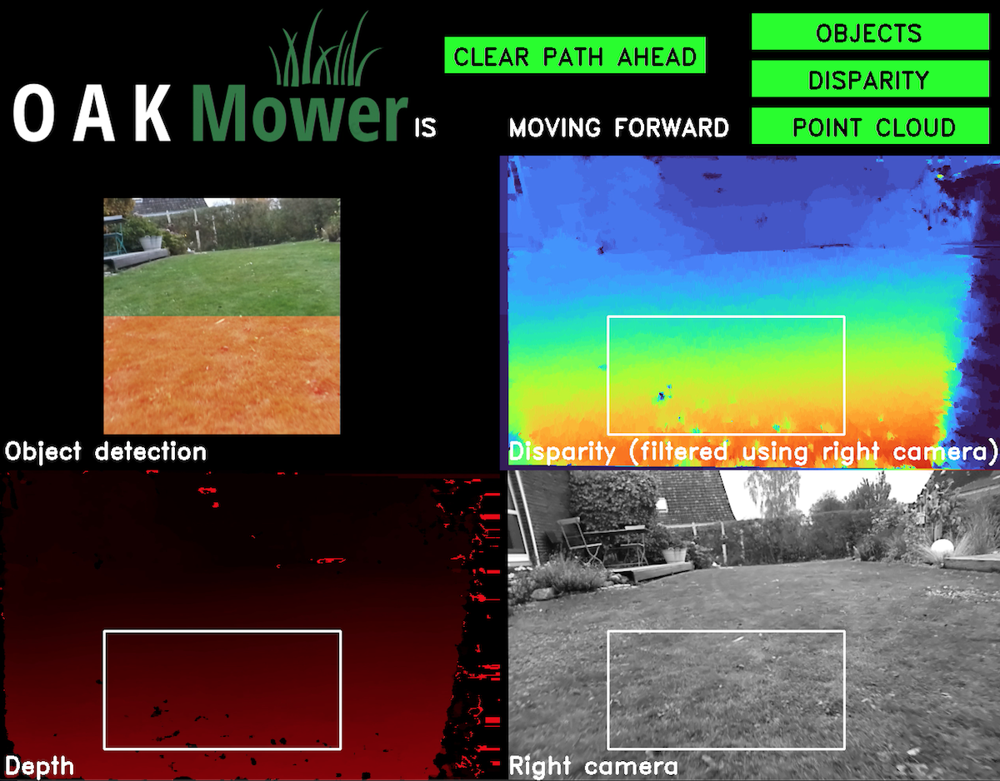           |    |  

#### Video recording & frame rate
The results were saved recording the screen as the robot was crossing the lawn. Noticable lags were caused by the host due to low battery and point cloud rendering.
 
Recording            |  Mower crashing into person (see below)   
:-------------------------:|:----------------------:
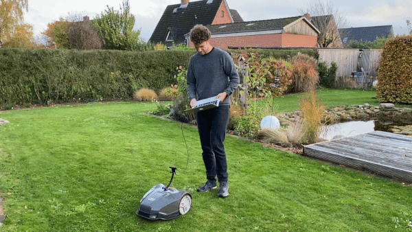  |  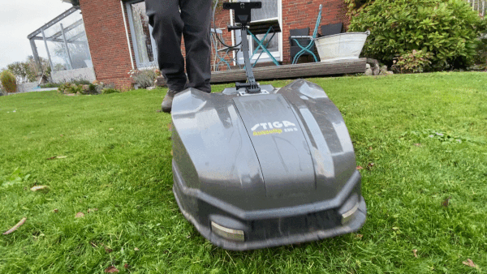

### Object classifier
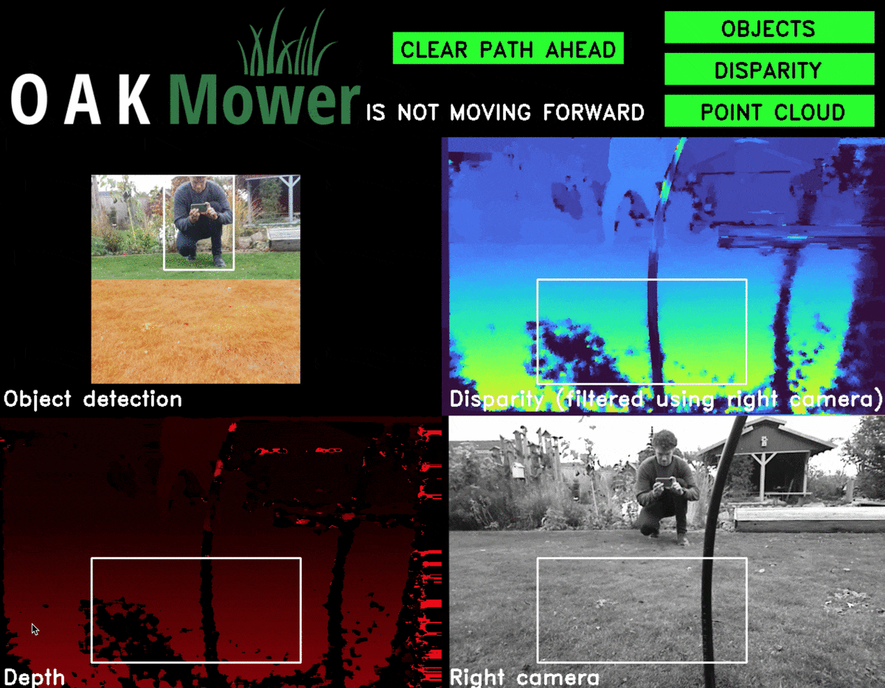  

### Point cloud and disparity classifier
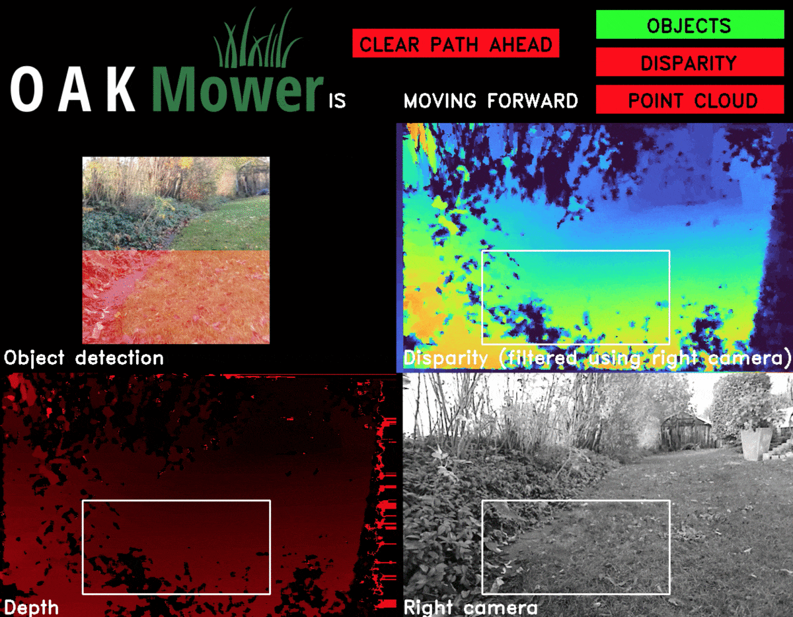

### Clear path
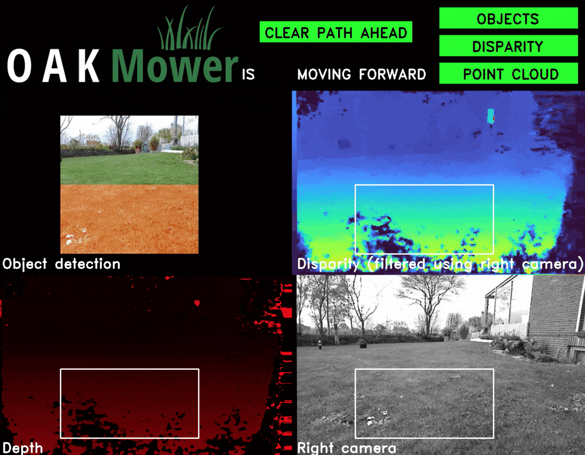

# Limitations
The device must be installed and oriented the same way as during training data collection for the point cloud classifier to perform as expected.
Sometimes the disparity classifier yields unexpected results. Most likely the labeled dataset was to small and a linear kernel and lower C parameter may have been the better choice to avoid potential overfitting.

Robot control was out of scope for this project and the device does not yet have an IP67 housing.

# Future work
So far the application has not been tested using the Raspberry Pi 4 host as initially planned since the laptop allowed for much more rapid changes while being outdoors. However, regarding computational power I do not expect problems.

Once the second generation pipeline builder is released, the inference capabilities could be used for semantic segmentation adding a fourth obstacle classification option. This will require a dataset that should include different locations, weather, leaves, etc. Once this is dataset exists, the performance and suitability of the object detection model can also be improved significantly.

To actually leverage the potential, a control interface is required.

# References
You can follow the links provided directly in both text and code to learn more and find the scienific work behind it referenced there. Mainly check out:
* [OpenCV Weighted Least Squares disparity filter](https://docs.opencv.org/3.4/d9/d51/classcv_1_1ximgproc_1_1DisparityWLSFilter.html)
* [DepthAI FAQs](https://docs.luxonis.com/faq/#how-do-i-calculate-depth-from-disparity)
* [Plane segmentation in Open3D](http://www.open3d.org/docs/release/python_api/open3d.geometry.PointCloud.html#open3d.geometry.PointCloud.segment_plane)
* [Elliptic Envelope for Outlier Detection](https://scikit-learn.org/stable/modules/generated/sklearn.covariance.EllipticEnvelope.html)
* [Support Vector Machine](https://scikit-learn.org/stable/modules/generated/sklearn.svm.SVC.html)
* [t-distributed Stochastic Neighbor Embedding](https://scikit-learn.org/stable/modules/generated/sklearn.manifold.TSNE.html)
